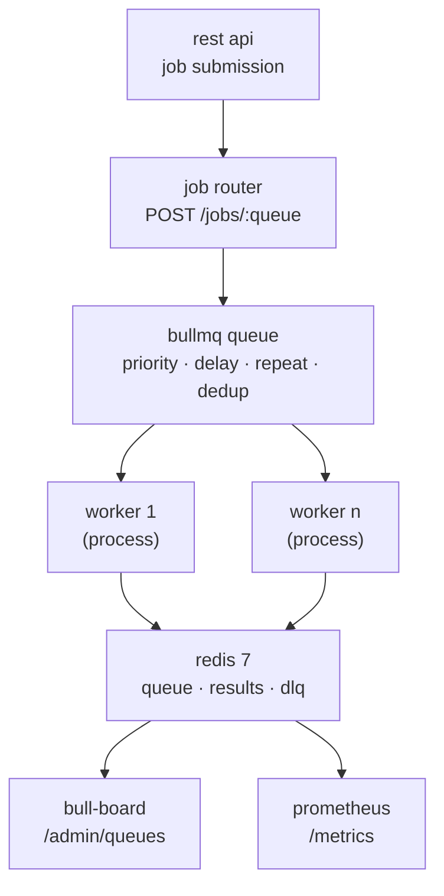

# job queue & worker system

[](https://nodejs.org)
[](https://www.typescriptlang.org)
[](https://bullmq.io)
[](LICENSE)
[](docker/docker-compose.yml)

a production-grade background job processing system built on [bullmq](https://bullmq.io) and redis 7. it supports priority queues, delayed jobs, exponential backoff retries, dead-letter queue routing, cron scheduling, a secured rest api, prometheus metrics, and a real-time bull-board dashboard - all in strict typescript with 188 passing tests.

---

## architecture



---

## prerequisites

| requirement | version                          |
| ----------- | -------------------------------- |
| node.js     | >= 20                            |
| redis       | >= 7                             |
| docker      | >= 24 (optional, for full stack) |

---

## quick start

```bash
# 1. clone & install
git clone https://github.com/bit2swaz/job-queue.git
cd job-queue
npm install

# 2. configure environment
cp .env.example .env
# edit .env - at minimum set JWT_SECRET

# 3. start redis (docker)
docker compose -f docker/docker-compose.test.yml up -d

# 4. start the api in dev mode
npm run dev
```

api will be available at `http://localhost:3000`.

---

## running workers

workers run in a separate process from the api (independently scalable):

```bash
# dev
npm run start:worker

# production (docker compose - 3 replicas by default)
docker compose up worker

# scale to 5 replicas
docker compose up --scale worker=5
```

---

## full stack (docker compose)

```bash
# copy and edit env
cp .env.example .env

# build and start all services (api, 3x worker, redis, prometheus)
docker compose -f docker/docker-compose.yml up --build

# services:
#   api         -> http://localhost:3000
#   prometheus  -> http://localhost:9090
#   redis       -> localhost:6379
```

---

## api reference

| method   | endpoint           | auth | description                  |
| -------- | ------------------ | ---- | ---------------------------- |
| `POST`   | `/auth/token`      | -    | issue a jwt                  |
| `POST`   | `/jobs/:queue`     | jwt  | submit a job                 |
| `GET`    | `/jobs/:queue/:id` | jwt  | job status, progress, result |
| `DELETE` | `/jobs/:queue/:id` | jwt  | cancel a waiting/delayed job |
| `GET`    | `/health`          | -    | redis ping + queue depths    |
| `GET`    | `/metrics`         | -    | prometheus text metrics      |
| `GET`    | `/admin/queues`    | jwt  | bull-board dashboard ui      |

### submit a job

```bash
# get a token
TOKEN=$(curl -s -XPOST http://localhost:3000/auth/token \
  -H 'Content-Type: application/json' \
  -d '{"sub":"alice","role":"admin"}' | jq -r .token)

# submit an email job
curl -XPOST http://localhost:3000/jobs/email \
  -H "Authorization: Bearer $TOKEN" \
  -H 'Content-Type: application/json' \
  -d '{"data":{"to":"alice@example.com","subject":"Hello","body":"World"}}'

# submit with options
curl -XPOST http://localhost:3000/jobs/email \
  -H "Authorization: Bearer $TOKEN" \
  -H 'Content-Type: application/json' \
  -d '{
    "data": {"to":"bob@example.com","subject":"Delayed","body":"Hi"},
    "opts": {"delay": 5000, "priority": 1},
    "idempotencyKey": "welcome-email-bob-001"
  }'
```

### known queues

| queue    | purpose                        | default attempts | default priority |
| -------- | ------------------------------ | ---------------- | ---------------- |
| `email`  | transactional email delivery   | 3                | -                |
| `report` | long-running report generation | 5                | 10               |
| `notify` | push / webhook notifications   | 3                | -                |
| `dlq`    | dead-letter (auto-routed)      | 1                | -                |

---

## running tests

```bash
# all tests
npm test

# unit tests only (no redis required)
npm run test:unit

# integration tests (requires redis on localhost:6379)
npm run test:integration

# coverage report
npm run test:coverage

# ci: spin up redis via docker, then run integration tests
docker compose -f docker/docker-compose.test.yml up -d
npm run test:integration
docker compose -f docker/docker-compose.test.yml down
```

---

## environment variables

| variable             | type     | default                  | required | description                           |
| -------------------- | -------- | ------------------------ | -------- | ------------------------------------- |
| `PORT`               | `number` | `3000`                   | no       | http server port                      |
| `REDIS_URL`          | `string` | `redis://localhost:6379` | no       | redis connection url                  |
| `JWT_SECRET`         | `string` | -                        | **yes**  | secret for jwt signing/verification   |
| `WORKER_CONCURRENCY` | `number` | `5`                      | no       | default workers per queue             |
| `NODE_ENV`           | `string` | `development`            | no       | `development` / `production` / `test` |

---

## project structure

```
src/
├── app.ts                    # express app factory (testable, no listen)
├── index.ts                  # http server entry point
├── worker.ts                 # worker process entry point
├── auth/
│   ├── jwtMiddleware.ts      # jwt verification middleware
│   └── tokenService.ts       # jwt issuance
├── config/
│   └── workers.ts            # concurrency + rate limiter config
├── dashboard/
│   └── board.ts              # bull-board setup
├── middleware/
│   └── validate.ts           # zod body validation factory
├── observability/
│   ├── metrics.ts            # prometheus registry + metric definitions
│   ├── workerMetrics.ts      # worker event -> metric hooks
│   └── queueScraper.ts       # periodic queue depth scraper
├── processors/
│   ├── base.ts               # BaseProcessor interface
│   ├── emailProcessor.ts
│   ├── reportProcessor.ts
│   ├── notifyProcessor.ts
│   ├── validators.ts
│   └── errors.ts
├── queues/
│   ├── queueManager.ts       # bullmq queue factory + registry
│   ├── queues.ts             # named queue singletons
│   ├── queueUtils.ts
│   └── scheduledJobs.ts      # cron scheduling helpers
├── routes/
│   ├── health.ts
│   ├── jobs.ts
│   └── metrics.ts
├── schemas/
│   └── jobSchemas.ts         # zod schemas for job submission
├── services/
│   ├── redisClient.ts        # ioredis singleton
│   ├── redisHealth.ts
│   ├── deadLetterService.ts  # dlq routing + replay
│   └── alertService.ts
├── utils/
│   ├── logger.ts             # pino logger singleton
│   └── shutdown.ts           # graceful shutdown handler
└── workers/
    ├── workerManager.ts      # worker factory
    ├── emailWorker.ts
    ├── reportWorker.ts
    └── notifyWorker.ts
```

---

## key design decisions

see [`docs/adr/`](docs/adr/) for full architecture decision records.

- **bullmq over bull v3** - typescript-first, active maintenance, redis streams
- **ioredis** - bullmq's recommended client, better reconnect handling
- **separate api/worker processes** - independent scaling and failure isolation
- **zod validation** - runtime type safety with typescript inference
- **pure processor functions** - no bullmq coupling in business logic

---

## contributing

see [CONTRIBUTING.md](CONTRIBUTING.md).
