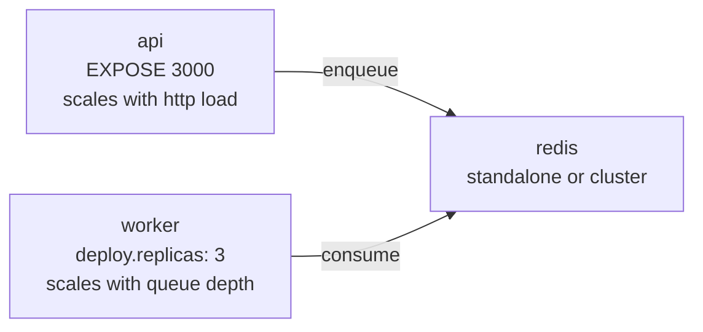

# adr-003: run the api server and workers as separate processes

**status:** accepted
**date:** 2026-03-12
**deciders:** project team

---

## context

bullmq jobs can be enqueued from a web process and consumed by workers in the same node.js process or in separate processes. we had to decide which topology to use for this system.

---

## decision

the **api server** (`src/index.ts`) and **workers** (`src/worker.ts`) are separate node.js entry points, intended to be run as separate os processes (or separate containers in docker compose).

---

## rationale

### independent scaling

the api receives http traffic; workers consume jobs from redis. these workloads have different resource profiles:

- api: i/o-bound, needs low latency, scales with request rate
- workers: cpu/memory-bound (report generation, image processing), scales with queue depth

running them together forces the same scaling policy on both, wasting resources.

### fault isolation

a worker crash (unhandled exception in a processor) cannot take down the api. the api continues to accept new job submissions while the worker is restarting.

### graceful shutdown

workers call `worker.close()` on `SIGTERM`, which drains in-flight jobs before exiting. the api can restart independently for deploys without interrupting long-running jobs.

### docker compose topology

workers can be scaled independently: `docker compose up --scale worker=10`.

---

## consequences

- `src/index.ts` starts only the express server; no `createWorker` calls.
- `src/worker.ts` imports all worker modules; no `app.listen` call.
- shared code (queue manager, processors, config) is imported in both entry points but executes in separate memory spaces.
- in development, two terminal tabs (or `npm run dev` + `npm run start:worker`) are required.
- in production docker compose, `api` and `worker` are separate services.
- the integration test suite starts the api via `supertest` (in-process); workers are started and closed by each test that needs them.

---

## alternatives rejected

- **monolith (api + workers in one process)**: simple to start but cannot scale api and workers independently. a crashed processor crashes the web server.
- **serverless functions for workers**: no persistent redis connection; incompatible with bullmq's blocking pop model. unsuitable for long-running jobs.
